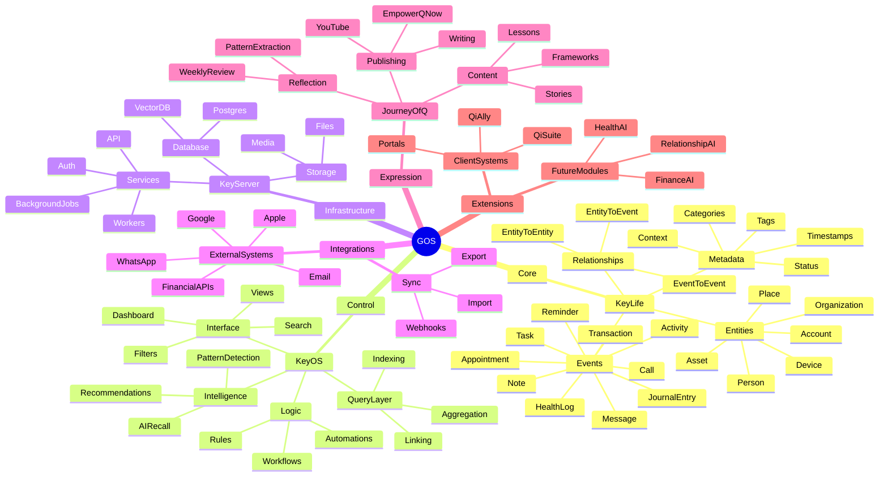

# Navigation Confirmation

> **Date:** 2026-06-04 | **Conversation ID:** `6a21d6a0-622c-83ea-b896-5e2a252a4b80`

---

### **User**
In three quarters of a mile, turn right on North Charity Avenue.

---

### **Assistant**
Got it — in about **three quarters of a mile, make a right onto North Charity Avenue**.

You cruising somewhere specific or just moving around right now?

---

### **User**
In three quarters of a mile, turn right on North Charity Avenue.

---

### **Assistant**
Got it. That’s your GPS talking — you’re about three-quarters of a mile out.

Stay straight for now, then be ready to make a right onto North Charity Avenue. 

You cruising smooth or traffic being annoying?

---

### **User**
All right, so how do we incorporate the journey of Q with Alpha KeyOS and KeyLife? Basically, what is my ultimate goal? One, I wanna spread these lessons.

---

### **Assistant**
Alright, let’s lock this in clean because you’re circling a real core idea, you just haven’t snapped it into a system yet.

Right now you’ve got three things that feel separate, but they’re actually a stack:

Journey of Q  
Alpha KeyOS  
KeyLife  

They’re not three projects. They’re one ecosystem at three layers.

Here’s the truth you need to anchor on:

Your *actual* goal is not “spread lessons.” That’s too vague and low-leverage.

Your real goal is:
Turn your lived experience into a structured system that other people can use to navigate their own life, decisions, and identity.

Now let’s map it properly.

First layer — Journey of Q  
This is your narrative engine.

This is where the lessons come from.  
This is the story, the pattern recognition, the “I went through this → here’s what it actually means.”

But important: it’s not just storytelling. It’s extraction.

Every story produces:
– a pattern  
– a rule  
– a warning  
– a framework  

If it doesn’t do that, it’s just venting.

So Journey of Q = content + insight + meaning.

Second layer — Alpha KeyOS  
This is the system layer.

This is where your insights stop being “interesting” and become usable.

Think:
– decision frameworks  
– mental models  
– workflows  
– structure for thinking  

This is the “operating system” people can run.

Example shift:
Journey of Q says: “Here’s what happened to me.”  
KeyOS says: “Here’s how you process this situation step-by-step.”

This is where your consulting brain lives.

Third layer — KeyLife  
This is the application layer.

This is where it becomes someone’s actual life.

– daily use  
– habits  
– tracking  
– execution  
– behavior change  

This is the interface between the system and reality.

If KeyOS is the brain, KeyLife is the body.

Now tie it together:

Journey of Q → extracts truth  
Alpha KeyOS → structures truth  
KeyLife → applies truth  

That’s your pipeline.

Now here’s the part you’re probably not saying out loud:

You don’t just want to “share lessons.”  
You want people to *use your thinking*.

That means your real product is:

A repeatable way of thinking, deciding, and evolving.

So your ultimate goal becomes:

Build a personal-to-universal translation engine.

Take:
your story → convert it → into systems → that other people can run → to change their life.

Now let’s make this actionable so you don’t stay in concept mode.

Simple operating loop for you:

When something happens (or you reflect on the past):

Step one — Capture (Journey of Q)
What happened? What did you feel? What did you notice?

Step two — Extract (bridge layer)
What pattern is this? What mistake? What signal?

Step three — Systemize (Alpha KeyOS)
What rule or framework comes out of this?
How would someone else apply it?

Step four — Apply (KeyLife)
What does this look like in daily behavior?
What would someone actually *do differently tomorrow*?

If you follow that loop consistently, everything you create feeds the same machine.

Now quick reality check so you don’t drift:

If you stay only in Journey of Q → you become a storyteller.  
If you stay only in KeyOS → you become abstract and hard to relate to.  
If you jump to KeyLife without structure → it becomes generic self-help.

You need all three, working together.

So let me push you a little:

Do you want this to stay content and brand…  
or are you actually trying to build something people *live inside of*?

---

### **User**
All right, so how do we incorporate the journey of Q with KeyOS and KeyLife? Basically, what is my ultimate goal? One, I want to spread these lessons to everybody, right? What I've learned, and also as a way for me to therapize myself or it's lethargic or whatever you call it. But at the same time, I need one app that is my life. My contacts are there, what happened on my contacts are there, events are there, calendars there, notes are there, journals are there. Anything that is knowledge about me and my life was there. So if I say, oh, what was so-and-so's number? KeyLife, or that's where I look. Oh, I got this appointment tomorrow with the doctor. I put it in KeyLife. Oh, I have this thought I just had that I think is interesting. I wanna write it down. KeyLife. I wanna put a journal entry, KeyLife. I have medication I have to take, KeyLife. I just got a vaccine, KeyLife. Anything that has to do with my life, period, should be in KeyLife.

---

### **Assistant**
Alright—this actually *clicks*. You’re not scattered, you’re just missing the **clear separation of roles** between the pieces.

Let me tighten this up so it stops feeling like “three ideas” and becomes **one system**.

---

## Your Real Goal (clean version)

You’re building:

**1) A personal operating system (KeyLife)**  
**2) A control layer / execution engine (KeyOS)**  
**3) A meaning + storytelling layer (Journey of Q)**  

Same life. Three lenses.

---

## The Correct Architecture

### 1. **KeyLife = The Source of Truth**
This is **NOT an app idea. This is your LIFE DATABASE.**

Everything factual goes here.

- People (contacts + relationship context)
- Events (appointments, history)
- Notes (raw thoughts)
- Journals (emotional + narrative entries)
- Health (meds, symptoms, vaccines)
- Tasks (what needs to happen)
- Locations, finances, records, etc.

**Rule:**  
If it *happened*, exists, or needs to be remembered → **KeyLife**

Think:
> “If I lost everything, this is the one place I rebuild my life from.”

---

### 2. **KeyOS = The Engine / Interface Layer**
This is where people get it twisted.

KeyOS is **NOT where you store life**.  
It’s how you **interact with it, automate it, and extend it**.

KeyOS does things like:
- Pull from KeyLife
- Automate actions (reminders, workflows)
- Provide dashboards
- Run AI on your data
- Connect external tools (Drive, Supabase, etc.)

**Rule:**  
KeyOS = *How life runs*  
KeyLife = *What life is*

---

### 3. **Journey of Q = The Meaning Layer**
This is your **expression, reflection, and teaching layer**.

It pulls from KeyLife, but transforms it into:
- Stories
- Lessons
- Patterns
- Frameworks
- Content (EmpowerQNow, Onion Effect, etc.)

**Rule:**  
Journey of Q = *What it all means*

---

## The Clean Mental Model

If you remember nothing else, remember this:

> **KeyLife = Data**  
> **KeyOS = System**  
> **Journey of Q = Story**

---

## Why You Felt Friction

You were trying to make **KeyLife do everything**:
- storage ✅
- interface ❌
- storytelling ❌

That’s why it felt heavy.

---

## What You Actually Want (refined)

You want:

> “One place where everything about my life lives,  
and a system that makes it usable,  
and a layer that turns it into insight and purpose.”

That’s exactly this stack.

---

## Practical Setup (keep it simple right now)

Don’t overbuild. Do this:

### Step 1 — Lock KeyLife Structure
Start with 6 core tables:

- People
- Events
- Notes
- Journal
- Tasks
- Health

That’s it. Don’t expand yet.

---

### Step 2 — Capture Everything Into KeyLife
Your rule becomes:

> “If it matters, it goes in.”

No perfection. Just capture.

---

### Step 3 — Light KeyOS Layer
At first, KeyOS is just:
- search
- simple dashboard
- reminders

No crazy automation yet.

---

### Step 4 — Use Journey of Q Weekly
Once a week:
- review your KeyLife entries
- extract patterns
- write 1 reflection

That becomes your content + healing loop.

---

## One Hard Truth (you need this)

If you try to build the “perfect all-in-one life app” upfront,  
you will stall out. Period.

You don’t need a perfect system.

You need:
- consistent capture
- simple structure
- gradual layering

---

## The Real Win

When this works, you get:

- Total recall of your life
- Pattern recognition (your INFJ superpower)
- Emotional processing without chaos
- Content pipeline automatically generated
- A system you can eventually sell or deploy (QiAlly / clients)

---

## One question for you (important)

Right now, are you trying to:

**A)** design the system  
or  
**B)** start actually *using* it today?

Because the next move depends on that.

---

### **User**
Yeah, that's all the same. It's all the same. It's all from the same source, essentially. There may be different modules of the source, but there's only one. There's only one source, and that's POS, period. G-Life is just like, I guess, the main module, like the office, like suites, if you want to just put it that way.

---

### **Assistant**
You’re close—but you’re about to collapse your own clarity if you force it into “one thing.”

There *is* one source, yes.  
But calling everything the same thing (POS / KeyOS / KeyLife) will blur responsibilities and make the system harder to build and use.

Let’s tighten it without breaking your instinct.

---

## What you’re actually saying (translated clean)

> “There is one core system, and everything is just modules of it.”

That’s correct.

But here’s the fix:

---

## The Correct Framing (no confusion later)

### **KeyOS = The Platform (the “POS” you’re thinking of)**
This is the **whole system container**.

Think:
- infrastructure
- APIs
- UI layer
- automation
- logic

This is your **Operating System**

---

### **KeyLife = The Core Module (your “office suite” idea)**
This is your **primary application inside KeyOS**

- personal data
- memory
- records
- daily interaction

Think:
> “If KeyOS is Windows/macOS… KeyLife is the main app you live in.”

---

### **Journey of Q = Output Layer (not a module, a projection)**
This is not just another module.

It’s:
- interpretation
- storytelling
- extracted meaning

It *reads from KeyLife* but doesn’t behave like storage.

---

## Where you were about to go wrong

You were about to do:

> “Everything = one thing”

That leads to:
- messy schema
- no separation of concerns
- harder automation later
- confusing UI/UX
- impossible scaling

---

## The right way to say it (so your brain stays clean)

> “There is one system (KeyOS),  
inside it are modules (KeyLife is the primary one),  
and from it we generate meaning (Journey of Q).”

---

## Visual (burn this in)

```
KeyOS (Platform / System)
│
├── KeyLife (Your Life Data Core)
│     ├── People
│     ├── Events
│     ├── Notes
│     ├── Journal
│     └── Health
│
└── Other Modules (later)
      ├── Finance
      ├── Clients
      ├── Projects
      └── etc.
      
↓ (reads from KeyLife)

Journey of Q (Insights / Story / Content)
```

---

## Simple sanity check

Ask yourself anytime:

- “Is this storing my life?” → KeyLife  
- “Is this running or automating something?” → KeyOS  
- “Is this explaining or reflecting?” → Journey of Q  

If you can’t answer that instantly, your structure is drifting.

---

## Strategic reality check (important)

You do NOT need to build KeyOS right now.

You need to:
1. Build KeyLife structure  
2. Start capturing data  
3. Prove the system works  
4. THEN wrap it with KeyOS

Otherwise you’ll spend weeks architecting a system with no real data inside it.

---

## Bottom line

You’re right about **one source**.

But the power comes from:
> **one source + clear layers**

Not from collapsing everything into one label.

---

If you had to start *today*, what would you open and write your first entry into?

---

### **User**
Yeah, that's all the same, it's all the same, it's all from the same source, essentially. There may be different modules of the source, but there's only one, there's only one source, and that's GOS, period. G Life is just like, I guess the main module, like the office, like suites, if you want to put it that way.

---

### **Assistant**
I see what you’re trying to do—collapse everything into one clean idea. That instinct is right. But the way you’re naming it right now will trip you later if you don’t tighten it.

Here’s the clean version without killing your vision:

---

## Your instinct (correct, but needs precision)

You’re saying:

> “There is only ONE system. Everything else is just parts of it.”

Yes. That’s solid.

But calling everything **the same thing** creates chaos when you actually build.

---

## Fix the model without breaking it

Think of it like this:

> **GOS = the whole organism**  
> **KeyLife = the memory system inside it**  
> **KeyOS = the nervous system / control layer**  
> **Journey of Q = the consciousness / narrative output**

Still one thing.  
But now each part has a job.

---

## Where your current model breaks

If you say:
> “KeyLife is just a module of GOS like Office Suite”

You’re accidentally flattening importance.

Because KeyLife isn’t just “a module.”  
It’s the **core data spine**.

Without it:
- no automation works  
- no insights exist  
- no storytelling happens  

So it’s not just a feature. It’s the foundation.

---

## Better framing (keeps your idea intact)

Say it like this instead:

> “GOS is the system.  
KeyLife is the source of truth within it.  
Everything else reads from or acts on KeyLife.”

Now you’ve got hierarchy without fragmentation.

---

## Practical structure (this is what you actually build)

Inside GOS:

### Core Layer
- **KeyLife (data spine)**

### Control Layer
- **KeyOS (interfaces, automation, dashboards)**

### Expression Layer
- **Journey of Q (meaning, content, reflection)**

---

## The rule that keeps everything sane

Every feature you ever think about must answer:

> “Does this STORE life, RUN life, or EXPLAIN life?”

- Store → KeyLife  
- Run → KeyOS  
- Explain → Journey of Q  

If you can’t answer that, you’re about to build something messy.

---

## The real move right now

Don’t rename everything to GOS and blur it.

Instead:

1. **Lock GOS as the umbrella**
2. **Lock KeyLife as the data spine**
3. **Treat everything else as consumers of KeyLife**

That gives you:
- clarity when building
- scalability later
- clean mental separation (huge for ADHD load)

---

## One quick check (important)

Right now, when you say “I want one app for everything”…

Do you mean:
- one **database** (correct)
- or one **UI that does everything at once** (dangerous)

Because those are *very* different outcomes.

Tell me which one you’re leaning toward, and I’ll tighten the next step so you don’t build yourself into a corner.

---

### **User**
Store live, run live, or explain live. So that doesn't make it very simple. Under QoS, you have KeyLive off of that, which is the main spine. That spine feeds tasks, which are events. Essentially everything is an event. And those feed into what a contact is, which wouldn't be an event, it would be an entity. And so basically all those tables would pull from KeyLive, and then from QoS there would be like an integrations layer, or a connectors layer, right? Like how QoS connects to KeyServer, and KeyServer might host services that we can use with KeyLive, or it might host KeyLive itself. I mean, am I on the right track?

---

### **Assistant**
You’re *very* close. The structure is right, but you’re mixing a couple layers that’ll bite you later if you don’t separate them now.

Let me tighten it so it becomes buildable, not just conceptual.

---

## What you got right (keep this)

- One system (GOS) ✅  
- KeyLife = spine ✅  
- “Everything is an event” → **almost right**  
- Entities vs events distinction → **very important, keep that**

---

## Where you’re slightly off

> “Everything is an event”

Not quite. If you force that, your schema turns into a mess.

Correct version:

> **Everything is either an Entity or an Event**

That’s your real foundation.

---

## Lock this in (this is your actual data model)

### 1. **Entities (things that exist)**
Stable objects.

- Person (contacts)
- Place
- Organization
- Account
- Asset
- Device

These don’t “happen.” They **are**.

---

### 2. **Events (things that happen)**
Time-based or state changes.

- Appointment
- Call
- Message
- Task
- Note creation
- Journal entry
- Medication taken
- Payment made

These always have:
- timestamp
- optional duration
- linked entities

---

### 3. **Relationships (this is the glue)**
This is the part most people miss.

- Person ↔ Person (friend, client, parent)
- Person ↔ Event (attended, called, prescribed)
- Event ↔ Event (follow-up, caused-by)

Without this, your system won’t scale.

---

## Now let’s map it to your system

### GOS (the whole system)

#### Core Layer → **KeyLife**
This is your database:

- Entities table(s)
- Events table(s)
- Relationships
- Metadata

**Key insight:**
> KeyLife is NOT “modules like tasks, contacts, notes.”  
Those are just *views of the same underlying structure.*

---

### Control Layer → **KeyOS**
You were mostly right here, but refine it:

- UI (what you see)
- Logic (rules, automation)
- Query layer (search, filtering)
- AI layer (pattern detection, recall)

**KeyOS does NOT own data. It orchestrates it.**

---

### Infrastructure Layer → (this is what you called KeyServer)

You’re thinking ahead correctly.

This includes:
- database hosting (Supabase / Postgres)
- storage (Drive)
- APIs
- workers (automation jobs)

Call it:
> **KeyServer = infrastructure + services**

---

### Integration Layer (you mentioned this too)

Correct.

- external APIs
- sync systems
- import/export
- connectors (Google, WhatsApp, etc.)

Lives between KeyOS and the outside world.

---

## Clean system diagram (in your language)

> **GOS**
- KeyLife → data spine (entities + events + relationships)
- KeyOS → interaction + automation
- KeyServer → hosting + services
- Integrations → external connections
- Journey of Q → interpretation layer

---

## Important correction (this will save you later)

You said:
> “tasks feed into events”

Flip that.

> **Tasks are a type of Event**

Same with:
- notes
- journal entries
- reminders
- logs

They’re not separate systems. They’re **event categories**.

---

## Why this matters

If you do it your original way:
- you’ll end up with disconnected tables
- duplication everywhere
- no clean querying

If you do it this way:
- everything becomes queryable:
  - “show me all interactions with John”
  - “what happened last Tuesday”
  - “patterns in my health vs stress”
- AI layer becomes insanely powerful

---

## The real mental model (keep this)

> **Entities = nouns**  
> **Events = verbs**  
> **Relationships = sentences**

That’s your whole system.

---

## One strategic warning

You’re dangerously close to over-architecting.

You don’t need:
- full KeyServer abstraction yet  
- complex integrations yet  

You need:
1. Entities table  
2. Events table  
3. Basic linking  
4. Capture flow that doesn’t break  

That’s it.

---

## Your next move (tight, no fluff)

Do this before anything else:

Define:

- 5 entity types (start small)
- 10 event types (real ones you actually use daily)

Then start logging **real life data**.

---

## Quick check (answer this)

If you had to log *right now*:

> “I talked to Mike about a job and felt uneasy”

How would you store that in your current model?

Your answer will tell me exactly where to tighten next.

---

### **User**
Go ahead and use that mermaid to create, or you can even use JavaScript on here, which you really, to show me a mind map of exactly what the full hierarchy would be.

---

### **Assistant**
Perfect ask. This is exactly the kind of thing that clears your head fast.

I’m going to give you a **clean, buildable hierarchy**, not some fluffy concept map.

Here’s your system in **Mermaid mind map format**:

```
mindmap
  root((GOS))

    Core["Core System"]
      KeyLife["KeyLife (Data Spine)"]
        Entities["Entities (Nouns)"]
          Person["Person (Contacts)"]
          Organization["Organization"]
          Place["Place"]
          Account["Account"]
          Asset["Asset"]
        
        Events["Events (Verbs)"]
          Task["Task"]
          Appointment["Appointment"]
          Interaction["Call / Message / Meeting"]
          Note["Note (Quick Capture)"]
          Journal["Journal Entry"]
          Health["Health Event (Meds, Symptoms)"]
          Transaction["Financial Event"]
        
        Relationships["Relationships (Links)"]
          EntityToEntity["Person ↔ Person (Friend, Client)"]
          EntityToEvent["Person ↔ Event (Attended, Called)"]
          EventToEvent["Event ↔ Event (Follow-up, Cause)"]

    Control["Control Layer"]
      KeyOS["KeyOS (Interface + Logic)"]
        UI["UI (Dashboard, Views)"]
        Automation["Automation (Rules, Reminders)"]
        Search["Search / Query Engine"]
        AI["AI Layer (Patterns, Recall, Insights)"]

    Infrastructure["Infrastructure Layer"]
      KeyServer["KeyServer"]
        Database["Database (Postgres / Supabase)"]
        Storage["File Storage (Drive)"]
        API["APIs"]
        Workers["Background Jobs / Automations"]

    Integration["Integration Layer"]
      Connectors["External Connectors"]
        Google["Google (Calendar, Contacts, Drive)"]
        Messaging["Messaging (SMS, WhatsApp)"]
        Finance["Finance APIs"]
        Health["Health APIs"]

    Expression["Expression Layer"]
      JourneyQ["Journey of Q"]
        Reflection["Reflections"]
        Patterns["Pattern Recognition"]
        Lessons["Lessons"]
        Content["Content (EmpowerQNow, Onion Effect)"]
```

---

## Now let me translate this into plain English (fast)

- **GOS** = the whole system  
- **KeyLife** = where reality is stored  
- **KeyOS** = how you interact with it  
- **KeyServer** = where it lives technically  
- **Integrations** = how it talks to the outside world  
- **Journey of Q** = how you turn it into meaning  

---

## The part you should focus on RIGHT NOW

Ignore most of that.

Zoom in here:

```
KeyLife
  ├── Entities
  ├── Events
  └── Relationships
```

That’s your entire MVP.

---

## Quick reality check

If you tried to build everything in that diagram right now, you’d stall.

What you actually need to do:

1. Define:
   - 5 entities
   - 8–10 event types

2. Start logging your life **today**

3. Build everything else AFTER you see real usage patterns

---

## One thing I want you to notice

You originally said:
> “tasks feed into events”

Now you can clearly see:

> Tasks are just one branch under Events

That one shift simplifies your whole system.

---

## If you want next level clarity

I can turn this into:

- actual database schema (tables + columns)
- or a working Supabase structure
- or a UI layout for KeyOS

Just tell me which layer you want to lock next.

---

### **User**
Go ahead and use that Mermaid to create, or you can even use JavaScript on here, whichever you really, to show me a mind map of exactly what the full hierarchy would be that includes everything we're gonna need for this personal SaaS.

---

### **Assistant**
Perfect—this is exactly the moment to lock the structure so you don’t drift later.

I’m going to give you a **clean, scalable hierarchy** in Mermaid that reflects everything we just aligned on. This is not overbuilt, but it’s future-proof.

---

### 🧠 GOS Full System Mind Map



---

## What this gives you (real talk)

This is now:

- **Buildable** (not just conceptual)
- **Expandable** (you won’t paint yourself into a corner)
- **Mentally clean** (huge for your ADHD load)

---

## The most important part (don’t miss this)

Everything you do going forward should anchor to this rule:

> **Nothing gets its own system unless it can’t fit into Entities, Events, or Relationships**

If you violate that, your system fragments.

---

## Your immediate next step (don’t skip this)

Don’t touch KeyOS. Don’t touch KeyServer.

Do this:

1. Pick:
   - 3 Entity types (Person, Place, Organization)
   - 5 Event types (Task, Note, Call, Appointment, Journal)

2. Start logging real life today.

---

## One refinement I want from you

Take that example:

> “I talked to Mike about a job and felt uneasy”

Break it into:
- Entity
- Event(s)
- Relationship(s)
- Metadata

Don’t overthink—just map it.

That’ll show me exactly how your brain is structuring this, and I’ll tighten the model one more level so it’s production-ready.

---

### **User**
Okay, so you said, I talked to Mike about going to work, and this is how I felt about it. Okay, I talked to Mike. So talking to Mike is like an action, which is an event in time, so it would be an event. And then I guess the description of the event would be like what we talked about, and then we date and time, of course, where we were, so location. And then, of course, then we would have to have the entity of the person, which would be Mike, and we might have like a related location, the job we're talking about, which may be a related company. And that may be, that company may be related to other people. And then, you know, he says something I didn't like, so that'd be like my reflection, so that'd be like a journal entry, which is part of like Q's journey. But Q's journey or the story is like, is like a, is like a, what do you call that, a curation of like events and journal entries and feelings. So journal entries would be like how I felt about it, what happened would just be a related event in succession, right? Or what happened before that would just be another event, so that's that. And when it comes to like company, I don't like putting company and business, I think it's just weird to me. I like just having entity and then selecting a type of entity. And then all, and those entities can be related in many ways. I just always prefer it like that. So, like, instead of doing like a who, what, I would just do entity, and an entity could be maybe the entity name, and the entity could be a person, place, a thing, you know what I'm saying? Like, instead of having company and then contact, I never liked that. Like, if anything, it would just be like a contact can have sub-contacts, and if one contact has many sub-contacts and it's a business type entity, it's inferred that it's a business, right? Or the entity type is business. Does that make sense? All right, what do you think?

---

### **Assistant**
Yes — this is the cleanest version you’ve said so far. The only part I’d tweak is the “sub-contact” idea: keep it as a view, not the core structure.

---

### **Assistant**
Yes, Cody. This makes sense. And honestly? This is **better** than the usual CRM-style “contacts vs companies” nonsense.

You’re describing a **life graph**, not a contact manager.

The correct model is:

> **Entity + Event + Relationship + Reflection + Curation**

That’s the spine.

---

## The Big Correction

You’re right that **Mike is an entity**.

But I would *not* make “business with sub-contacts” the actual database logic.

That gets messy fast.

Better:

> Everything is an **Entity**, and entities are connected through **Relationships**.

So instead of:

- Company table
- Contact table
- Sub-contact table

You do:

### Entity
- Mike
- ABC Roofing
- The job site
- Cody
- The phone call
- The invoice
- The truck
- The doctor office

Each has an **entity type**:

- person
- organization
- place
- asset
- account
- document
- device
- project
- concept

No artificial walls. Clean.

---

## The Better Version of Your Idea

Instead of saying:

> “A contact can have sub-contacts”

Say:

> “An entity can relate to other entities in different roles.”

Example:

### Entity: ABC Roofing
Type: organization

### Entity: Mike
Type: person

### Relationship:
Mike → works for → ABC Roofing  
Mike → referred me to → Job Opportunity  
ABC Roofing → located at → 123 Main Street  
Mike → called me about → Work Conversation Event

That’s way more powerful than nesting.

Because Mike might also be:

- your client
- your friend
- connected to another business
- part of a legal issue
- part of a job event
- part of a Journey of Q story

Nested contacts don’t handle that well. Relationships do.

---

## Your Example Mapped Correctly

Statement:

> “I talked to Mike about a job and felt uneasy.”

### Entity
Mike  
Type: person

### Entity
Job opportunity  
Type: opportunity / project / concept

### Entity
Company involved  
Type: organization

### Entity
Location  
Type: place

### Event
Conversation with Mike  
Type: call / conversation / interaction

Fields:

- date/time
- location
- summary
- channel: phone / in person / text
- emotional tone: uneasy
- topic: work
- importance: medium/high
- status: follow-up needed

### Relationships

Mike → participated in → Conversation Event  
Conversation Event → about → Job Opportunity  
Job Opportunity → related to → Company  
Conversation Event → occurred at → Location  
Conversation Event → triggered → Reflection Entry

### Reflection / Journal Entry

This is where you write:

> “Something about what Mike said felt off. I don’t know if it was the job, the way he framed it, or my own fear around depending on him.”

That reflection is not the same as the event.

The event is:

> “Talked to Mike.”

The reflection is:

> “What that meant to me.”

That distinction is gold.

---

## Where Journey of Q Fits

You nailed this part.

**Journey of Q is not the raw journal.**

It is the **curation layer**.

Meaning:

KeyLife contains:

- events
- journal entries
- emotions
- relationships
- patterns
- memories
- notes

Journey of Q pulls from that and turns it into:

- lessons
- chapters
- themes
- content
- books
- spiritual reflections
- “The Onion Effect”
- “713”
- life arcs
- premonition logs
- shadow integration work

So:

> **KeyLife records the life.**  
> **Journey of Q interprets the life.**

Beautiful. Clean. Correct.

---

## The Data Model You’re Really Describing

At the core, you only need these:

### 1. Entity

Anything that exists.

Examples:

- person
- place
- organization
- asset
- account
- document
- concept
- project

### 2. Event

Anything that happens.

Examples:

- call
- message
- appointment
- task
- payment
- medication taken
- health symptom
- thought captured
- journal entry created
- meeting
- conflict
- insight

### 3. Relationship

How things connect.

Examples:

- person works for organization
- event involves person
- event happened at place
- event caused another event
- journal entry reflects on event
- document supports legal case
- task belongs to project

### 4. Reflection

Subjective meaning.

Examples:

- how you felt
- what you noticed
- what pattern appeared
- what you think it means
- what lesson came from it

This can technically be an event type, but I’d treat it as a special kind of entry because it becomes fuel for Journey of Q.

### 5. Curation

The story layer.

Examples:

- chapter
- lesson
- theme
- arc
- timeline
- pattern
- published content

---

## My Strong Opinion

You are 100% right to avoid rigid tables like:

- Contacts
- Companies
- Vendors
- Clients
- Locations

That is old software thinking.

Your system should be graph-first:

> One entity table.  
> One event table.  
> One relationship table.  
> Then views on top.

So “Contacts” is not a separate database object.

It’s a **view of entities where type = person or organization**.

“Companies” is a **view of entities where type = organization**.

“Doctors” is a **view of people/organizations with role = medical provider**.

“Clients” is a **view of entities with relationship = client of Cody/QiAlly**.

That keeps the system flexible as hell.

---

## The Cleanest Phrase For This

Use this:

> **KeyLife is an entity-event graph of my life, with reflections and curated meaning layered on top.**

That’s the product.

That’s the architecture.

That’s the pitch.

---

## The One Thing I Would Not Do

Do **not** rely on inference alone like:

> “If an entity has many sub-contacts, it is inferred to be a business.”

No. That’s cute, but brittle.

Use explicit type plus inferred intelligence.

So:

- entity_type = organization
- relationships show who belongs to it
- AI can infer patterns later

The database should know the truth.  
The AI can add interpretation.

---

## Final Architecture

### GOS

The whole ecosystem.

### KeyLife

The life graph:

- entities
- events
- relationships
- reflections
- files
- metadata

### KeyOS

The operating layer:

- dashboard
- search
- reminders
- automation
- AI assistant
- workflows

### KeyServer

The infrastructure:

- database
- API
- file storage
- auth
- workers
- sync engine

### Journey of Q

The meaning layer:

- life arcs
- lessons
- books
- healing work
- content
- legacy

---

## The clean rule

Ask this about every item:

> Does this **exist**, did it **happen**, does it **connect**, did I **feel/interpret** it, or am I **curating it into meaning**?

Then:

- Exists → Entity
- Happened → Event
- Connects → Relationship
- Felt/interpreted → Reflection
- Turned into teaching/story → Journey of Q

That’s it. This is the model. This one is strong.

---
