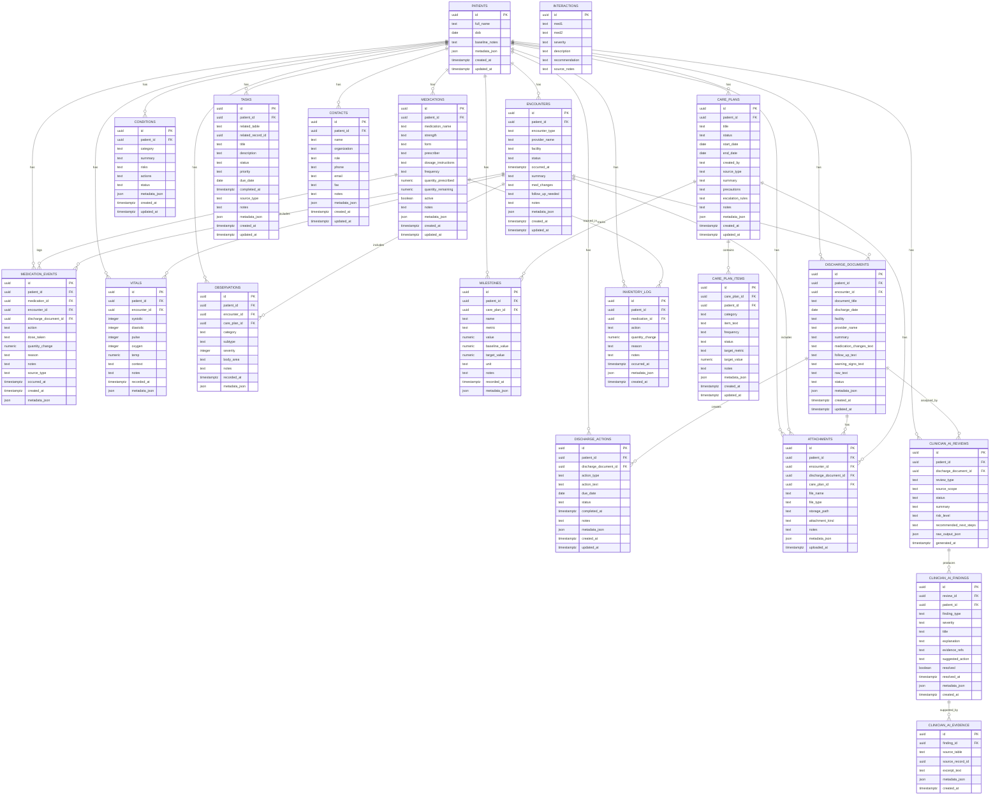

# Care App Architecture, Schema, and ERD

## Purpose

This document is the working source of truth for the care app build. It covers:

- recommended repo structure
- final table set
- table relationships
- initial Supabase/Postgres SQL schema
- Mermaid ERD

This is designed for a mobile-first care app using Cloudflare on the app edge and Supabase for database, auth, and storage.

---

## Build Goals

The system needs to support:

- fast bedside entry from phone
- medication tracking
- vitals logging
- symptom and observation tracking
- milestones and goal progress
- encounter and discharge documentation
- care plans
- actionable follow-up tasks
- clinician-facing AI review and findings
- attachment uploads for photos and paperwork

---

## Recommended Repo Tree

```text
care-app/
├── README.md
├── .env.example
├── .gitignore
├── package.json
├── pnpm-lock.yaml
├── tsconfig.json
├── vite.config.ts
├── wrangler.toml
├── care_app_erd.mmd
│
├── docs/
│   ├── architecture.md
│   ├── schema-notes.md
│   ├── ai-review-spec.md
│   ├── intake-flows.md
│   ├── care-plan-model.md
│   ├── discharge-workflow.md
│   └── import-mapping.md
│
├── database/
│   ├── README.md
│   ├── migrations/
│   │   ├── 0001_extensions.sql
│   │   ├── 0002_tables_core.sql
│   │   ├── 0003_tables_care_plans.sql
│   │   ├── 0004_tables_discharge.sql
│   │   ├── 0005_tables_ai.sql
│   │   ├── 0006_tables_support.sql
│   │   ├── 0007_indexes.sql
│   │   ├── 0008_rls_policies.sql
│   │   ├── 0009_storage.sql
│   │   └── 0010_seed_reference.sql
│   │
│   ├── seeds/
│   │   ├── seed_conditions.sql
│   │   ├── seed_interactions.sql
│   │   └── seed_demo_patient.sql
│   │
│   ├── functions/
│   │   ├── recalc_med_inventory.sql
│   │   ├── patient_timeline.sql
│   │   ├── due_discharge_actions.sql
│   │   └── unresolved_ai_findings.sql
│   │
│   └── views/
│       ├── active_medications.sql
│       ├── patient_dashboard.sql
│       ├── patient_timeline.sql
│       └── clinician_brief.sql
│
├── scripts/
│   ├── import/
│   ├── export/
│   ├── maintenance/
│   └── dev/
│
├── public/
│   ├── icons/
│   ├── manifest.webmanifest
│   └── favicon.ico
│
├── src/
│   ├── main.tsx
│   ├── app/
│   ├── config/
│   ├── lib/
│   ├── components/
│   ├── features/
│   ├── workers/
│   ├── state/
│   ├── styles/
│   └── types/
│
├── supabase/
│   ├── config.toml
│   └── seed.sql
│
├── imports/
│   ├── raw/
│   ├── mapped/
│   └── archive/
│
├── tests/
│   ├── unit/
│   ├── integration/
│   └── e2e/
│
└── .github/
    └── workflows/
```

---

## Final Table Set

### Core operational tables

- `patients`
- `medications`
- `medication_events`
- `vitals`
- `observations`
- `encounters`
- `milestones`
- `conditions`
- `care_plans`
- `care_plan_items`
- `discharge_documents`
- `discharge_actions`
- `attachments`

### AI / intelligence tables

- `interactions`
- `clinician_ai_reviews`
- `clinician_ai_findings`
- `clinician_ai_evidence`

### Operational support tables

- `inventory_log`
- `tasks`
- `contacts`

---

## Relationship Overview

- one `patient` has many medications, events, vitals, observations, encounters, milestones, care plans, discharge docs, tasks, contacts, attachments, and AI reviews
- one `medication` has many medication events and inventory log entries
- one `encounter` can have many vitals, observations, medication events, attachments, and discharge documents
- one `discharge_document` can have many discharge actions and attachments
- one `care_plan` can have many care plan items, milestones, and attachments
- one AI review can produce many AI findings
- one AI finding can have many evidence rows

---

## Initial SQL Schema

```sql
create extension if not exists pgcrypto;

create table patients (
  id uuid primary key default gen_random_uuid(),
  full_name text,
  dob date,
  baseline_notes text,
  metadata_json jsonb default '{}'::jsonb,
  created_at timestamptz default now(),
  updated_at timestamptz default now()
);

create table medications (
  id uuid primary key default gen_random_uuid(),
  patient_id uuid not null references patients(id) on delete cascade,
  medication_name text not null,
  strength text,
  form text,
  prescriber text,
  dosage_instructions text,
  frequency text,
  quantity_prescribed numeric,
  quantity_remaining numeric,
  active boolean default true,
  notes text,
  metadata_json jsonb default '{}'::jsonb,
  created_at timestamptz default now(),
  updated_at timestamptz default now()
);

create table encounters (
  id uuid primary key default gen_random_uuid(),
  patient_id uuid not null references patients(id) on delete cascade,
  encounter_type text,
  provider_name text,
  facility text,
  status text,
  occurred_at timestamptz,
  summary text,
  med_changes text,
  follow_up_needed text,
  notes text,
  metadata_json jsonb default '{}'::jsonb,
  created_at timestamptz default now(),
  updated_at timestamptz default now()
);

create table care_plans (
  id uuid primary key default gen_random_uuid(),
  patient_id uuid not null references patients(id) on delete cascade,
  title text not null,
  status text,
  start_date date,
  end_date date,
  created_by text,
  source_type text,
  summary text,
  precautions text,
  escalation_rules text,
  notes text,
  metadata_json jsonb default '{}'::jsonb,
  created_at timestamptz default now(),
  updated_at timestamptz default now()
);

create table discharge_documents (
  id uuid primary key default gen_random_uuid(),
  patient_id uuid not null references patients(id) on delete cascade,
  encounter_id uuid references encounters(id) on delete set null,
  document_title text,
  discharge_date date,
  facility text,
  provider_name text,
  summary text,
  medication_changes_text text,
  follow_up_text text,
  warning_signs_text text,
  raw_text text,
  status text,
  metadata_json jsonb default '{}'::jsonb,
  created_at timestamptz default now(),
  updated_at timestamptz default now()
);

create table medication_events (
  id uuid primary key default gen_random_uuid(),
  patient_id uuid not null references patients(id) on delete cascade,
  medication_id uuid references medications(id) on delete set null,
  encounter_id uuid references encounters(id) on delete set null,
  discharge_document_id uuid references discharge_documents(id) on delete set null,
  action text not null,
  dose_taken text,
  quantity_change numeric,
  reason text,
  notes text,
  source_type text,
  occurred_at timestamptz default now(),
  created_at timestamptz default now(),
  metadata_json jsonb default '{}'::jsonb
);

create table vitals (
  id uuid primary key default gen_random_uuid(),
  patient_id uuid not null references patients(id) on delete cascade,
  encounter_id uuid references encounters(id) on delete set null,
  systolic integer,
  diastolic integer,
  pulse integer,
  oxygen integer,
  temp numeric,
  context text,
  notes text,
  recorded_at timestamptz default now(),
  metadata_json jsonb default '{}'::jsonb
);

create table observations (
  id uuid primary key default gen_random_uuid(),
  patient_id uuid not null references patients(id) on delete cascade,
  encounter_id uuid references encounters(id) on delete set null,
  care_plan_id uuid references care_plans(id) on delete set null,
  category text,
  subtype text,
  severity integer,
  body_area text,
  notes text,
  recorded_at timestamptz default now(),
  metadata_json jsonb default '{}'::jsonb
);

create table milestones (
  id uuid primary key default gen_random_uuid(),
  patient_id uuid not null references patients(id) on delete cascade,
  care_plan_id uuid references care_plans(id) on delete set null,
  name text not null,
  metric text,
  value numeric,
  baseline_value numeric,
  target_value numeric,
  unit text,
  notes text,
  recorded_at timestamptz default now(),
  metadata_json jsonb default '{}'::jsonb
);

create table conditions (
  id uuid primary key default gen_random_uuid(),
  patient_id uuid not null references patients(id) on delete cascade,
  category text,
  summary text,
  risks text,
  actions text,
  status text,
  metadata_json jsonb default '{}'::jsonb,
  created_at timestamptz default now(),
  updated_at timestamptz default now()
);

create table care_plan_items (
  id uuid primary key default gen_random_uuid(),
  care_plan_id uuid not null references care_plans(id) on delete cascade,
  patient_id uuid not null references patients(id) on delete cascade,
  category text,
  item_text text not null,
  frequency text,
  status text,
  target_metric text,
  target_value numeric,
  notes text,
  metadata_json jsonb default '{}'::jsonb,
  created_at timestamptz default now(),
  updated_at timestamptz default now()
);

create table discharge_actions (
  id uuid primary key default gen_random_uuid(),
  patient_id uuid not null references patients(id) on delete cascade,
  discharge_document_id uuid not null references discharge_documents(id) on delete cascade,
  action_type text,
  action_text text not null,
  due_date date,
  status text,
  completed_at timestamptz,
  notes text,
  metadata_json jsonb default '{}'::jsonb,
  created_at timestamptz default now(),
  updated_at timestamptz default now()
);

create table attachments (
  id uuid primary key default gen_random_uuid(),
  patient_id uuid not null references patients(id) on delete cascade,
  encounter_id uuid references encounters(id) on delete set null,
  discharge_document_id uuid references discharge_documents(id) on delete set null,
  care_plan_id uuid references care_plans(id) on delete set null,
  file_name text,
  file_type text,
  storage_path text,
  attachment_kind text,
  notes text,
  metadata_json jsonb default '{}'::jsonb,
  uploaded_at timestamptz default now()
);

create table clinician_ai_reviews (
  id uuid primary key default gen_random_uuid(),
  patient_id uuid not null references patients(id) on delete cascade,
  discharge_document_id uuid references discharge_documents(id) on delete set null,
  review_type text not null,
  source_scope text,
  status text,
  summary text,
  risk_level text,
  recommended_next_steps text,
  raw_output_json jsonb default '{}'::jsonb,
  generated_at timestamptz default now()
);

create table clinician_ai_findings (
  id uuid primary key default gen_random_uuid(),
  review_id uuid not null references clinician_ai_reviews(id) on delete cascade,
  patient_id uuid not null references patients(id) on delete cascade,
  finding_type text,
  severity text,
  title text,
  explanation text,
  evidence_refs text,
  suggested_action text,
  resolved boolean default false,
  resolved_at timestamptz,
  metadata_json jsonb default '{}'::jsonb,
  created_at timestamptz default now()
);

create table clinician_ai_evidence (
  id uuid primary key default gen_random_uuid(),
  finding_id uuid not null references clinician_ai_findings(id) on delete cascade,
  source_table text,
  source_record_id uuid,
  excerpt_text text,
  metadata_json jsonb default '{}'::jsonb,
  created_at timestamptz default now()
);

create table inventory_log (
  id uuid primary key default gen_random_uuid(),
  patient_id uuid not null references patients(id) on delete cascade,
  medication_id uuid references medications(id) on delete set null,
  action text,
  quantity_change numeric,
  reason text,
  notes text,
  occurred_at timestamptz default now(),
  metadata_json jsonb default '{}'::jsonb,
  created_at timestamptz default now()
);

create table tasks (
  id uuid primary key default gen_random_uuid(),
  patient_id uuid not null references patients(id) on delete cascade,
  related_table text,
  related_record_id uuid,
  title text not null,
  description text,
  status text,
  priority text,
  due_date date,
  completed_at timestamptz,
  source_type text,
  notes text,
  metadata_json jsonb default '{}'::jsonb,
  created_at timestamptz default now(),
  updated_at timestamptz default now()
);

create table contacts (
  id uuid primary key default gen_random_uuid(),
  patient_id uuid not null references patients(id) on delete cascade,
  name text not null,
  organization text,
  role text,
  phone text,
  email text,
  fax text,
  notes text,
  metadata_json jsonb default '{}'::jsonb,
  created_at timestamptz default now(),
  updated_at timestamptz default now()
);

create table interactions (
  id uuid primary key default gen_random_uuid(),
  med1 text not null,
  med2 text not null,
  severity text,
  description text,
  recommendation text,
  source_notes text
);

create index idx_medications_patient_id on medications(patient_id);
create index idx_medication_events_patient_id on medication_events(patient_id);
create index idx_medication_events_medication_id on medication_events(medication_id);
create index idx_vitals_patient_id on vitals(patient_id);
create index idx_observations_patient_id on observations(patient_id);
create index idx_encounters_patient_id on encounters(patient_id);
create index idx_milestones_patient_id on milestones(patient_id);
create index idx_conditions_patient_id on conditions(patient_id);
create index idx_care_plans_patient_id on care_plans(patient_id);
create index idx_care_plan_items_care_plan_id on care_plan_items(care_plan_id);
create index idx_discharge_documents_patient_id on discharge_documents(patient_id);
create index idx_discharge_actions_discharge_document_id on discharge_actions(discharge_document_id);
create index idx_attachments_patient_id on attachments(patient_id);
create index idx_clinician_ai_reviews_patient_id on clinician_ai_reviews(patient_id);
create index idx_clinician_ai_findings_review_id on clinician_ai_findings(review_id);
create index idx_inventory_log_medication_id on inventory_log(medication_id);
create index idx_tasks_patient_id on tasks(patient_id);
create index idx_contacts_patient_id on contacts(patient_id);
```

---

## Mermaid ERD



---

## Practical Notes

### Why `metadata_json` exists

This is the pressure valve for edge-case data so you do not keep exploding the schema for one-off fields.

### Why `tasks` exists separately from discharge actions

Not every task comes from discharge paperwork. Some come from care plans, medication refills, equipment, or general caregiver operations.

### Why `contacts` exists

You will need a place for PCP, pulmonologist, pharmacy, DME provider, hospital department, and caregiver contacts.

### Build order

Recommended implementation order:

1. patients
2. medications
3. medication_events
4. vitals
5. observations
6. milestones
7. encounters
8. discharge_documents
9. discharge_actions
10. care_plans
11. tasks
12. contacts
13. clinician AI reviews/findings/evidence

---

## Next Step

Use this document as the base artifact in the repo. Then split the SQL into migration files and place the Mermaid block into `care_app_erd.mmd`.

